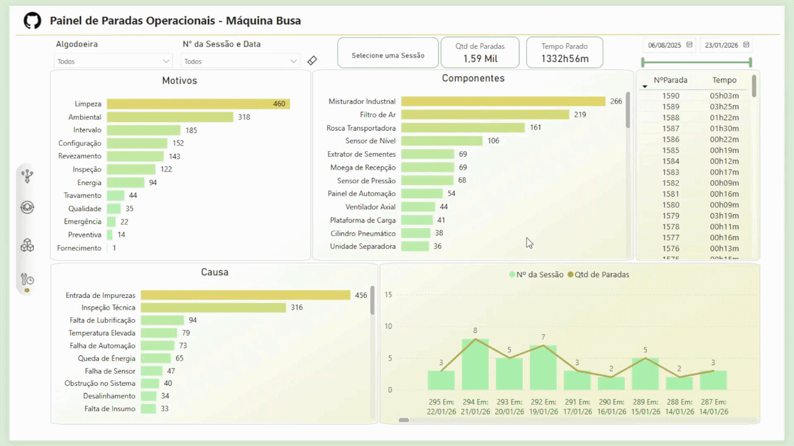

# 📊 Busa Operational Downtime Dashboard
🇧🇷 Versão em português: [README.pt-br.md](./README.pt-br.md)

## 🎯 Objective

Support management visibility over operational downtime events in the Busa machine, enabling better monitoring of equipment performance, identification of recurring failures, and analysis of downtime impact in the cotton processing operation.

---

## 🧰 Tools & Technologies

* Power BI (Data Visualization & Dashboarding)
* DAX (Measures & KPIs)
* SQL (Data Extraction & Transformation)
* Power Query (Data Cleaning & Modeling)

---

## 📈 Key Metrics

* Total downtime (hours and minutes)
* Effective session downtime (considering impact percentage)
* Session efficiency percentage
* Downtime by component
* Downtime by operational motive
* Downtime distribution by shift and session
* Downtime by business unit (facility)

---

## 🖼️ Dashboard Preview

---

## 💡 Insights

* Provides strong support for management presentations, offering clear visibility into operational downtime and equipment performance.
* Enables identification of components with the highest downtime impact, supporting maintenance prioritization.
* Highlights the main root causes of downtime, allowing targeted actions to reduce failures.
* Supports analysis of operational motives, helping distinguish between planned and unplanned stops.
* Allows monitoring of downtime behavior across shifts, improving operational planning and efficiency.

---

## 📂 Data & Queries

This project includes SQL queries organized in `queries.sql`, responsible for:

* Extracting downtime events from industrial process data
* Mapping components, causes, and operational motives
* Calculating total downtime duration and effective downtime based on impact percentage
* Structuring session, shift, and facility context for analysis

---

## 📊 Data Modeling

Downtime events were modeled using a dimensional approach, separating components, causes, and motives to enable multi-level operational analysis in Power BI.

---

## ⚠️ Notes

* All data used in this project is **anonymized and slightly adjusted** to preserve confidentiality.
* Labels and values were modified while maintaining realistic industrial scenarios.

---

## 🚀 Business Impact

This dashboard enables:

* Support for management presentations with clear operational insights
* Better control and monitoring of equipment downtime
* Identification of recurring failures and critical components
* Improved visibility into operational inefficiencies
* Data-driven decisions to reduce downtime and improve process reliability
