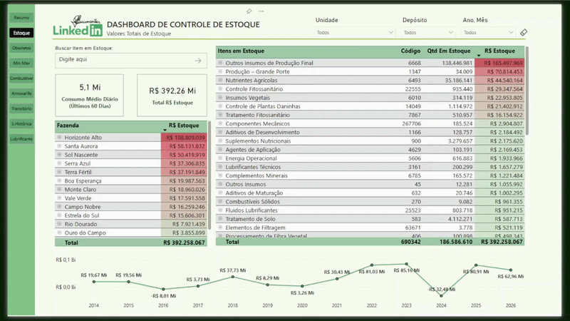

# 📊 Inventory Movement & Obsolescence Dashboard

## 🎯 Objective

Support management presentations by providing clear visibility into inventory levels, stock movement, and obsolete items, enabling better control over stock value and operational efficiency.

---

## 🧰 Tools & Technologies

* Power BI (Data Visualization & Dashboarding)
* DAX (Measures & KPIs)
* SQL (Data Extraction & Transformation)
* Power Query (Data Cleaning & Modeling)

---

## 📈 Key Metrics

* Total inventory value (R$)
* Average daily consumption
* Stock balance (inbound vs outbound)
* Inventory distribution by business unit
* Obsolete stock value (items without movement)
* Days without movement (inventory aging)

---

## 🖼️ Dashboard Preview

---

## 💡 Insights

* Provides strong support for management-level presentations, offering a clear view of total inventory value and stock distribution across units.
* Enables quick identification of obsolete items with long periods without movement, reducing financial waste.
* Supports decision-making for stock redistribution and purchasing adjustments based on consumption patterns.
* Highlights inventory aging, helping prioritize actions on inactive or slow-moving items.
* Improves control over inventory costs by identifying excess stock and inefficient allocation.

---

## 📂 Data & Queries

This project includes SQL queries organized in a single file (`queries.sql`), covering:

* Consolidation of inventory data from multiple business units
* Monthly aggregation of stock movements (inbound and outbound)
* Identification of latest inventory activity (last entry and exit)
* Calculation of stock balance and inactive inventory periods

---

## 📊 Data Modeling

Data was structured and transformed in Power BI using Power Query and DAX, ensuring efficient analysis and clear visualization of inventory metrics.

---

## ⚠️ Notes

* All data used in this project is **fictional or anonymized** for demonstration purposes.
* Values and labels were slightly adjusted to preserve confidentiality while maintaining realistic business scenarios.

---

## 🚀 Business Impact

This dashboard enables:

* Better control of total inventory value and financial exposure
* Identification and reduction of obsolete stock
* More efficient inventory management across business units
* Data-driven decisions for procurement and stock allocation
