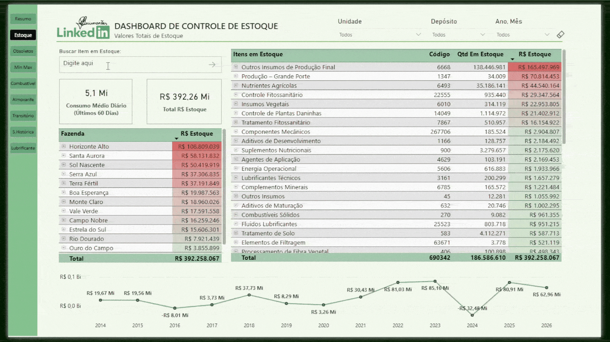

# 📊 Painel de Controle de Movimentação e Obsolescência de Estoque
🇺🇸 English version: [README.md](./README.md)

## 🎯 Objetivo

Apoiar as apresentações gerenciais, fornecendo visibilidade clara dos níveis de estoque, movimentação de estoque e itens obsoletos, permitindo melhor controle sobre o valor do estoque e a eficiência operacional.

---

## 🧰 Ferramentas e Tecnologias

* Power BI (Visualização de Dados e Dashboards)
* DAX (Medidas e KPIs)
* SQL (Extração e Transformação de Dados)
* Power Query (Limpeza e Modelagem de Dados)

---

## 📈 Métricas Principais

* Valor total do estoque (R$)
* Consumo médio diário
* Saldo de estoque (entrada vs. saída)
* Distribuição do estoque por unidade de negócios
* Valor do estoque obsoleto (itens sem movimentação)
* Dias sem movimentação (envelhecimento do estoque)

---

## 🖼️ Pré-visualização do Dashboard

---

## 💡 Insights

* Oferece um forte suporte para apresentações gerenciais, proporcionando uma visão clara do valor total do estoque e da sua distribuição. entre unidades.

* Permite a rápida identificação de itens obsoletos com longos períodos sem movimentação, reduzindo o desperdício financeiro.

* Auxilia na tomada de decisões para redistribuição de estoque e ajustes de compras com base nos padrões de consumo.

* Destaca o envelhecimento do estoque, ajudando a priorizar ações em itens inativos ou de baixa rotatividade.

* Melhora o controle dos custos de estoque, identificando excesso de estoque e alocação ineficiente.

---

## 📂 Dados e Consultas

Este projeto inclui a consulta SQL organizada em (`queries.sql`), abrangendo:

* Consolidação de dados de estoque de múltiplas unidades de negócios
* Agregação mensal de movimentações de estoque (entrada e saída)
* Identificação da atividade de estoque mais recente (última entrada e saída)
* Cálculo do saldo de estoque e períodos de inatividade

---

## 📊 Modelagem de Dados

Os dados foram estruturados e transformados no Power BI usando Power Query e DAX, garantindo análise eficiente e visualização clara das métricas de estoque.

---

## ⚠️ Observações

* Todos os dados utilizados neste projeto foram **anonimizados** para fins de demonstração.

* Os valores e rótulos foram ligeiramente ajustados para preservar a confidencialidade, mantendo cenários de negócios realistas.

---

## 🚀 Impacto nos Negócios

Este painel permite:

* Melhor controle do valor total do estoque e da exposição financeira
* Identificação e redução de estoque obsoleto
* Gestão de estoque mais eficiente em todas as unidades de negócios
* Decisões baseadas em dados para compras e alocação de estoque
