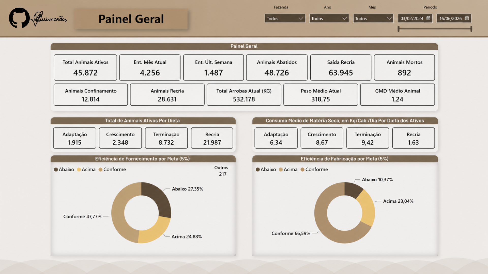
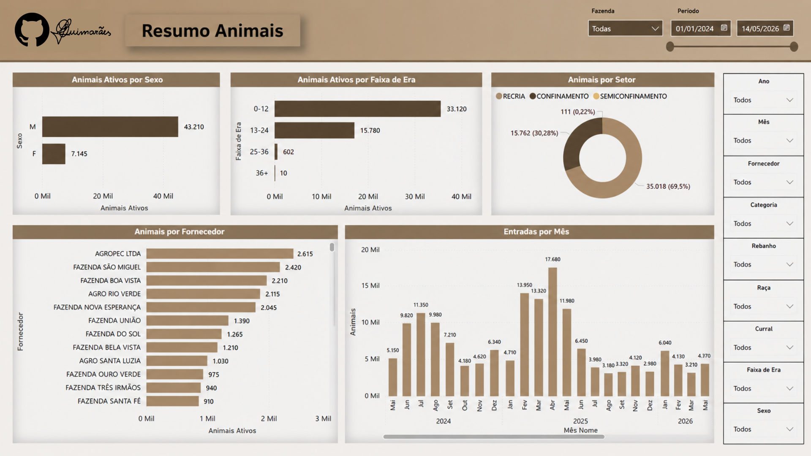
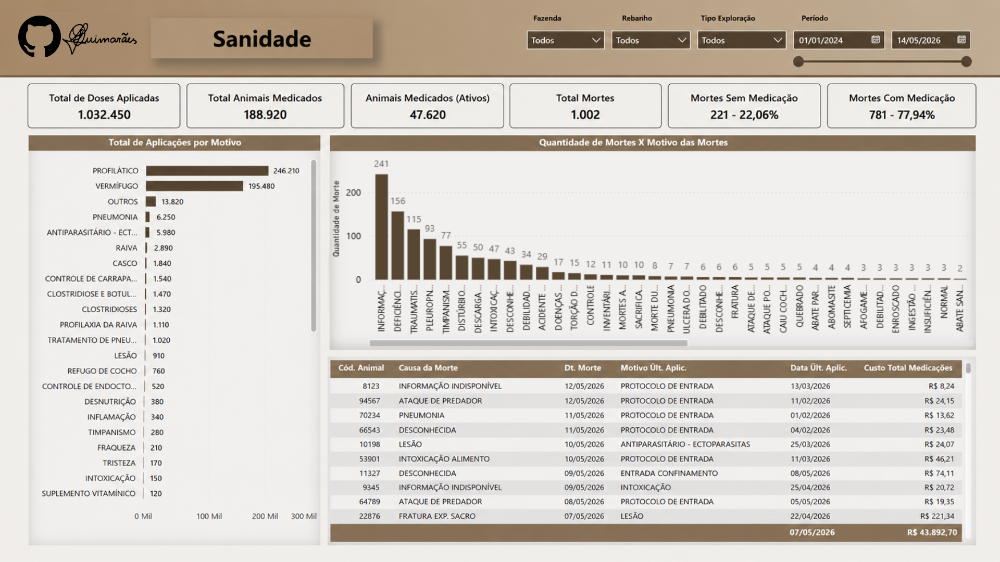
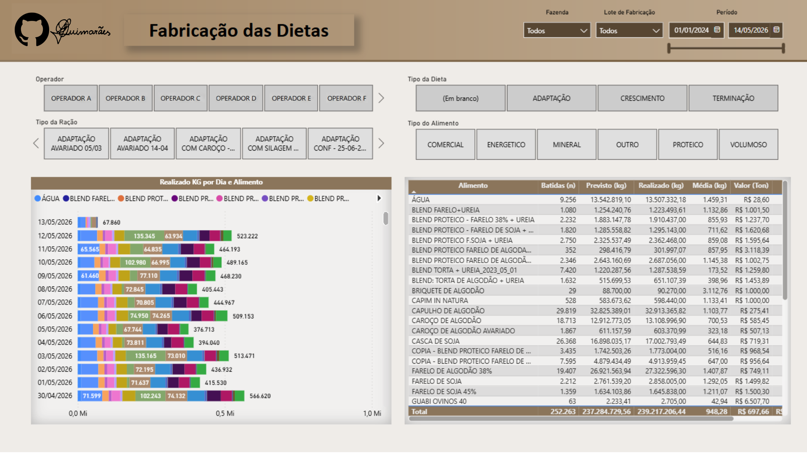
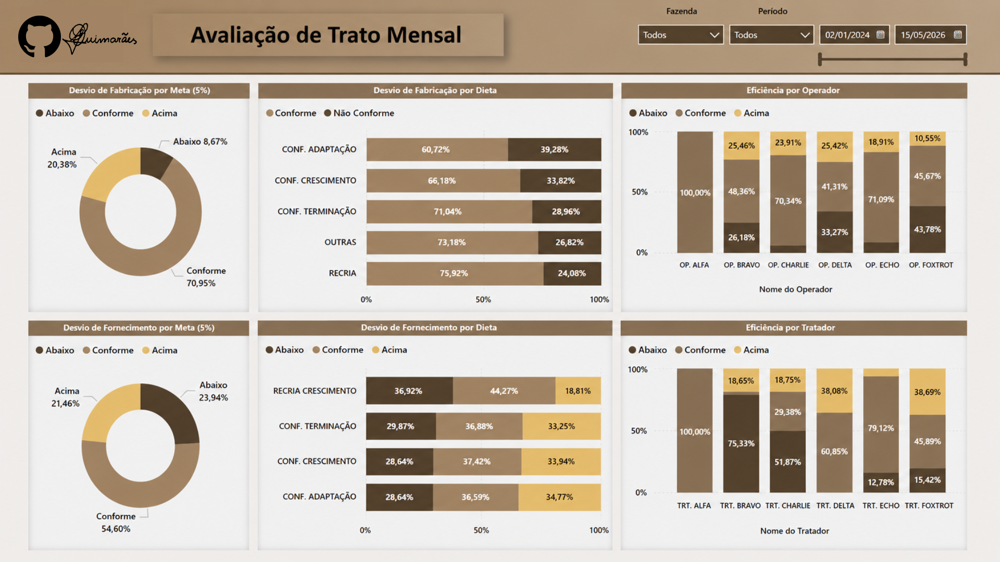
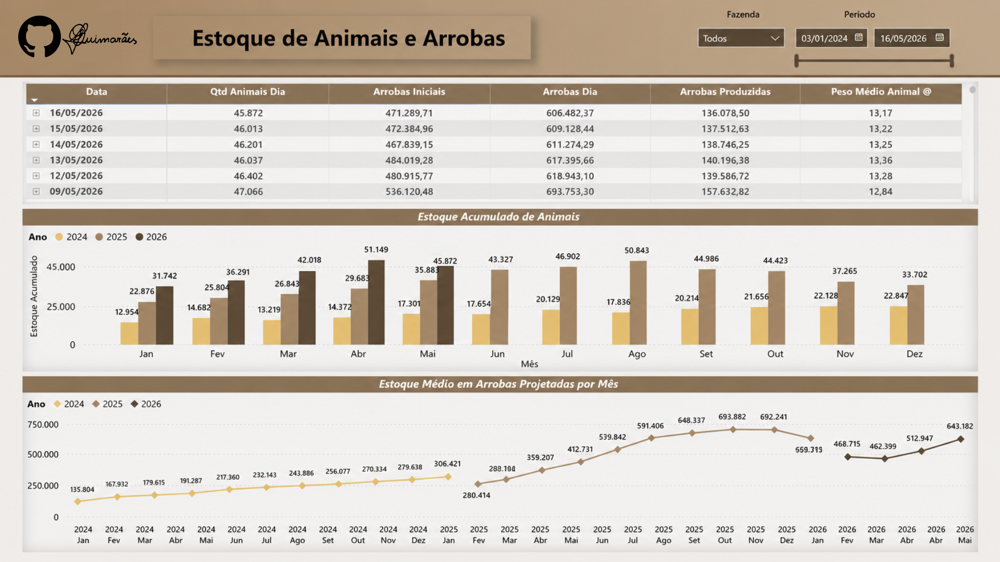

# 🐄 Livestock Operations & Performance Dashboard

🇧🇷 Versão em português: [README.pt-br.md](./README.pt-br.md)

## 🎯 Objective

Monitor livestock operations through integrated analysis of animal stock, production, health, feeding, and operational efficiency indicators.

---

## 🧰 Tools & Technologies

* Power BI
* DAX
* SQL
* Power Query

---

## 📈 Key Metrics

* Active animals and stock evolution
* Slaughter volume and projected arrobas
* Animal health and mortality indicators
* Diet production and feeding efficiency
* Operational performance monitoring

---

## 🖼️ Dashboard Preview

### General Overview

### Livestock Summary

### Health Monitoring

### Diet Production

### Feeding Performance

### Animal Stock

---

## 🚧 Project Status

This dashboard is currently under development and new analytical modules may be added over time.

---

## ⚠️ Notes

* All data displayed in this project is anonymized for demonstration purposes.
* SQL extraction and transformation layers are not available in this version.
