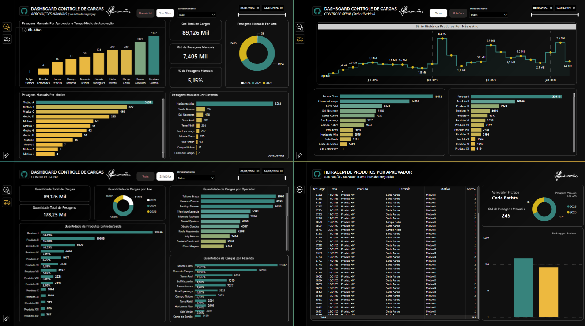

# 📊 Manual Weighing Control Dashboard

## 🎯 Objective

Support management presentations by providing clear visibility into manually recorded truck weighings, enabling better control of operational issues, identification of recurring problems, and monitoring of process efficiency.

---

## 🧰 Tools & Technologies

* Power BI (Data Visualization & Dashboarding)
* DAX (Measures & KPIs)
* SQL (Data Extraction & Transformation)
* Power Query (Data Cleaning & Modeling)

---

## 📈 Key Metrics

* Total number of manual weighings
* Manual weighings by business unit
* Main reasons for manual weighing
* Distribution by product and load type (inbound/outbound)
* Average approval time (minutes)
* Manual weighing occurrence by operator

---

## 🖼️ Dashboard Preview

---

## 💡 Insights

* Provides strong support for management-level presentations, offering clear visibility into operational issues related to manual weighings.
* Enables identification of business units with the highest occurrence of manual weighing events.
* Highlights the main causes of system failures or infrastructure issues affecting the weighing process.
* Supports monitoring of approval time, helping identify delays in operational flow.
* Allows analysis of which products and load types are most impacted by manual processes.

---

## 📂 Data & Queries

This project includes SQL queries organized in a single file (`queries.sql`), covering:

* Extraction of manual weighing records (first and second weighing)
* Identification of operators responsible for weighing
* Mapping of business units and products involved
* Tracking of approval flow and calculation of approval time
* Consolidation of inbound and outbound load movements

---

## 📊 Data Modeling

Data was structured and transformed in Power BI using Power Query and DAX, ensuring efficient analysis and clear visualization of operational metrics.

---

## ⚠️ Notes

* All data used in this project is **fictional or anonymized** for demonstration purposes.
* Values and labels were slightly adjusted to preserve confidentiality while maintaining realistic operational scenarios.

---

## 🚀 Business Impact

This dashboard enables:

* Support for management presentations with clear operational insights
* Better control over manual weighing occurrences
* Identification of recurring operational or infrastructure issues
* Monitoring of approval time and process delays
* Data-driven decisions to reduce manual interventions and improve system reliability
