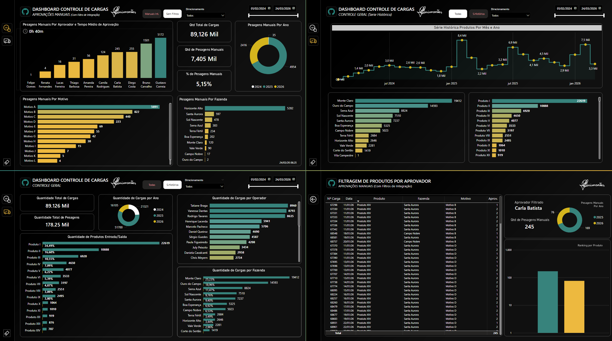
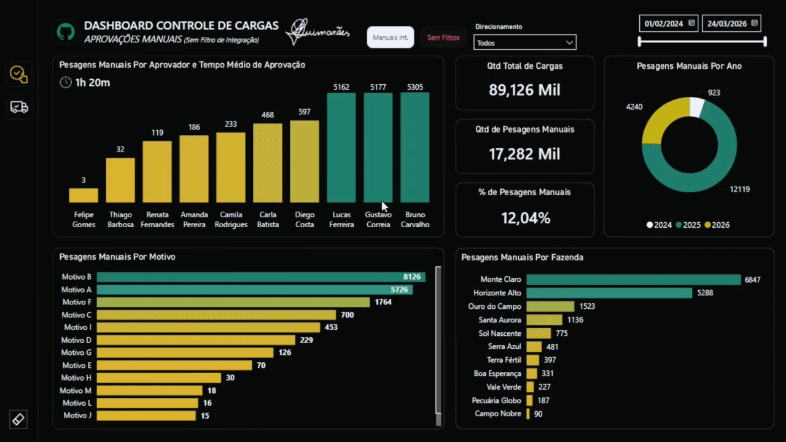

# 📊 Painel de Controle de Pesagem Manual
🇺🇸 English version: [README.md](./README.md)

## 🎯 Objetivo

Apoiar as apresentações da gerência, fornecendo visibilidade clara das pesagens manuais de caminhões, permitindo melhor controle de problemas operacionais, identificação de problemas recorrentes e monitoramento da eficiência do processo.

---

## 🧰 Ferramentas e Tecnologias

* Power BI (Visualização de Dados e Dashboards)
* DAX (Medidas e KPIs)
* SQL (Extração e Transformação de Dados)
* Power Query (Limpeza e Modelagem de Dados)

---

## 📈 Métricas Principais

* Número total de pesagens manuais
* Pesagens manuais por unidade de negócio
* Principais motivos para pesagem manual
* Distribuição por produto e tipo de carga (entrada/saída)
* Tempo médio de aprovação (minutos)
* Ocorrência de pesagem manual por operador

---

## 🖼️ Pré-visualização do Dashboard

---

## 💡 Insights

* Oferece um forte suporte para apresentações de nível gerencial, proporcionando uma visão clara das questões operacionais relacionadas às pesagens manuais.

* Permite identificar as unidades de negócio com maior ocorrência de pesagens manuais.
* Destaca as principais causas de falhas no sistema ou problemas de infraestrutura que afetam o processo de pesagem.

* Auxilia no monitoramento do tempo de aprovação, ajudando a identificar atrasos no fluxo operacional.

* Permite analisar quais produtos e tipos de carga são mais impactados por processos manuais.

---

## 📂 Dados e Consultas

Este projeto inclui consultas SQL organizadas em um único arquivo (`queries.sql`), abrangendo:

* Extração de registros de pesagem manual (primeira e segunda pesagem)
* Identificação dos operadores responsáveis ​​pela pesagem
* Mapeamento das unidades de negócio e produtos envolvidos
* Rastreamento do fluxo de aprovação e cálculo do tempo de aprovação
* Consolidação das movimentações de carga de entrada e saída

---

## 📊 Modelagem de Dados

Os dados foram estruturados e transformados no Power BI usando Power Query e DAX, garantindo uma análise eficiente e uma visualização clara das métricas operacionais.

---

## ⚠️ Observações

* Todos os dados utilizados neste projeto são **fictícios ou anonimizados** para fins de demonstração.

* Os valores e rótulos foram ligeiramente ajustados para preservar a confidencialidade, mantendo cenários operacionais realistas.

---

## 🚀 Impacto nos Negócios

Este painel permite:

* Suporte para apresentações gerenciais com insights operacionais claros
* Melhor controle sobre ocorrências de pesagem manual
* Identificação de problemas operacionais ou de infraestrutura recorrentes
* Monitoramento do tempo de aprovação e atrasos no processo
* Decisões baseadas em dados para reduzir intervenções manuais e melhorar a confiabilidade do sistema
