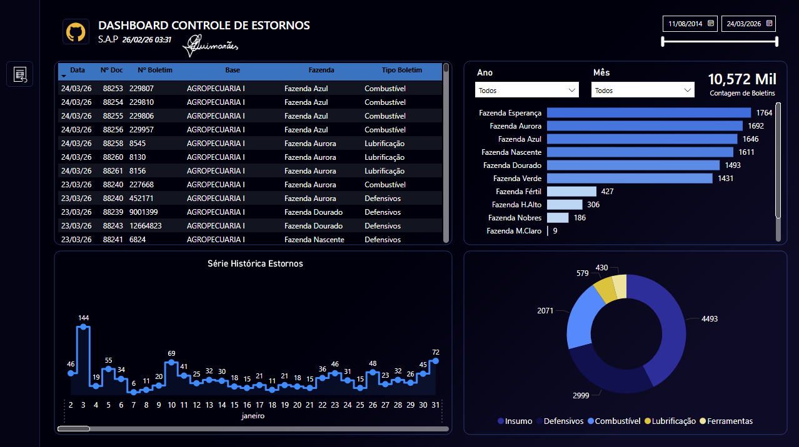

# 📊 Bulletin Reversal Control Dashboard
🇧🇷 Versão em português: [README.pt-br.md](./README.pt-br.md)

## 🎯 Objective

Support management visibility over reversal transactions (estornos), enabling better control of operational inconsistencies, identification of recurring errors, and monitoring of reversal behavior across business units.

---

## 🧰 Tools & Technologies

* Power BI (Data Visualization & Dashboarding)
* SQL (Data Extraction & Consolidation)
* Power Query (Data Transformation)
* DAX (Metrics & Aggregations)

---

## 📈 Key Metrics

* Total number of reversal transactions
* Reversals by business unit (farm/operation)
* Reversals by bulletin type (Fuel, Planting, Supply, etc.)
* Historical trend of reversals over time
* Distribution of reversals by operational category

---

## 🖼️ Dashboard Preview

---

## 💡 Insights

* Provides strong support for management presentations, offering clear visibility into reversal activity across operations.
* Enables identification of business units with the highest volume of reversals, highlighting potential process issues.
* Helps detect recurring patterns of operational errors through historical trend analysis.
* Supports analysis of which types of operations (e.g., fuel, planting, supply) are most impacted by reversals.
* Facilitates monitoring of data consistency and operational reliability across different units.

---

## 📂 Data & Queries

This project includes SQL queries consolidated in `queries.sql`, responsible for:

* Extracting reversal-related records from multiple business units
* Standardizing data across different ERP schemas
* Classifying bulletin types into unified categories
* Consolidating all sources into a single analytical dataset

---

## 📊 Data Modeling

Data was transformed and structured in Power BI using Power Query and DAX, ensuring consistent categorization and efficient analytical performance.

---

## ⚠️ Notes

* All data used in this project is **anonymized and slightly adjusted** to preserve confidentiality.
* The analytical structure and logic reflect real-world operational scenarios.

---

## 🚀 Business Impact

This dashboard enables:

* Support for management presentations with clear operational insights
* Better control and monitoring of reversal transactions
* Identification of recurring operational errors
* Improved visibility into process inconsistencies across business units
* Data-driven actions to reduce rework and improve operational accuracy
