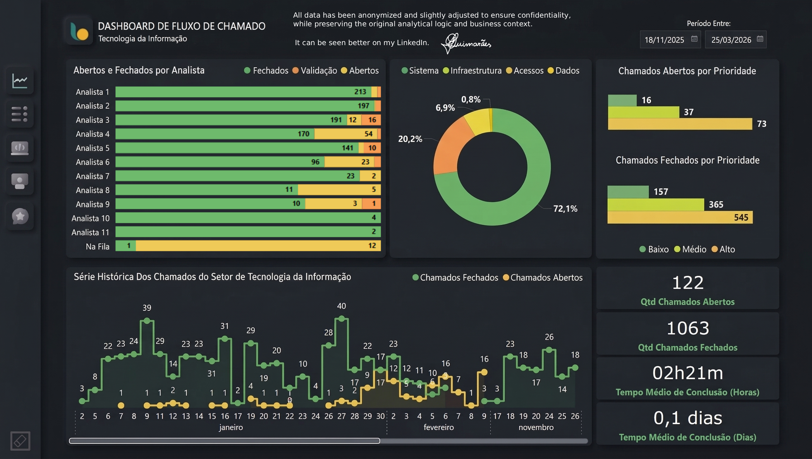
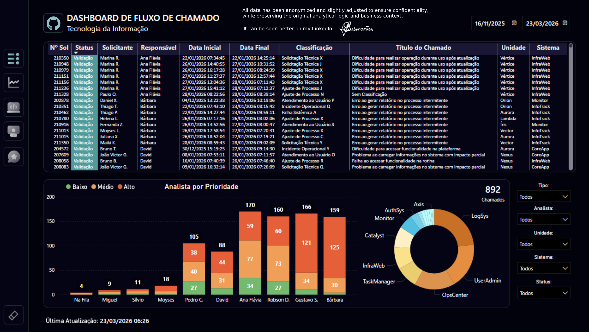

# 📊 IT SLA Dashboard

## 🎯 Objective

Assist management presentations by providing clear visibility into IT service performance, including open tickets, average resolution time, and workload distribution.

---

## 🧰 Tools & Technologies

* Power BI (Data Visualization & Dashboarding)
* DAX (Measures & KPIs)
* SQL (Data Extraction & Transformation)
* Power Query (Data Cleaning & Modeling)

---

## 📈 Key Metrics

* Total number of tickets (open vs closed)
* Average resolution time
* SLA compliance rate
* Ticket distribution by category, system and priority
* Analyst performance (handling time and workload)

---

## 🖼️ Dashboard Preview

---

## 💡 Insights

* Provides strong support for management-level presentations, offering a clear view of IT service performance and workload distribution.
* Enables quick identification of tickets with long resolution times, helping prioritize critical cases.
* Supports decision-making for reallocating tickets across analysts, improving overall efficiency and SLA compliance.
* Tickets involving third-party dependencies significantly impact resolution time.

---

## 📂 Data & Queries

This project includes SQL queries organized in a single file (`queries.sql`), covering:

* Data extraction from workflow and service request tables
* Assignment tracking and runtime calculation
* Filtering of operational noise (automations, queues, and non-relevant tasks)
* Preparation of satisfaction survey data for analysis

---

## 📊 Data Modeling
Data was structured and transformed in Power BI using Power Query and DAX, ensuring efficient analysis and clear visualization of key metrics.

---

## ⚠️ Notes

* All data used in this project is **fictional or anonymized** for demonstration purposes.
* Satisfaction metrics were calculated in Power BI using DAX measures, while SQL was used to extract and prepare the source data.

---

## 🚀 Business Impact

This dashboard enables:

* Support for management presentations with clear and structured IT service data
* Better control and monitoring of open tickets
* Clear visibility of average resolution time and execution performance
* Improved tracking of workload distribution across analysts
* Faster identification of tickets with long resolution times, enabling prioritization and reallocation
