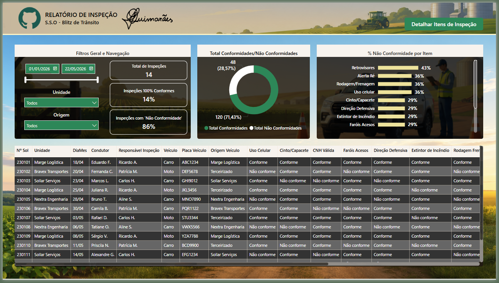
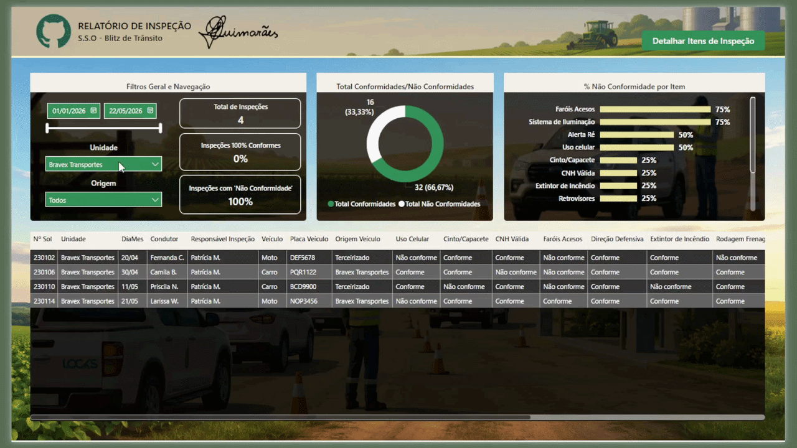

# 🚗 Traffic Inspection Dashboard
🇧🇷 Versão em português: [README.pt-br.md](./README.pt-br.md)

## 🎯 Objective

Assist occupational safety management by providing clear visibility into traffic inspection results, including driver and vehicle compliance, non-compliance rates, and critical safety items identified during field inspections.

---

## 🧰 Tools & Technologies

* Power BI (Data Visualization & Dashboarding)
* DAX (Measures & KPIs)
* SQL (Data Extraction & Transformation)
* Power Query (Data Cleaning & Modeling)

---

## 📈 Key Metrics

* Total number of inspections
* Compliance vs non-compliance rate
* Percentage of fully compliant inspections
* Non-compliance distribution by inspection item
* Driver and vehicle inspection details
* Inspection filtering by date, unit and origin

---

## 🖼️ Dashboard Preview

---

## 💡 Insights

* Provides clear visibility into traffic inspection results performed by the Occupational Safety area.
* Enables quick identification of the most frequent non-compliance items, such as driver's license, reverse alert, braking/tires, cellphone use while driving, seat belt and defensive driving.
* Supports preventive actions by highlighting recurring safety deviations across drivers, vehicles, units and origins.
* Improves operational traceability by consolidating detailed inspection records in a single analytical view.

---

## 📂 Data & Queries

This project includes SQL query consolidated in `queries.sql`, responsible for:

* Driver and vehicle inspection data
* Compliance and non-compliance classification by safety item
* Inspection filtering by date, unit and origin
* Preparation of operational inspection data for dashboard analysis

---

## 📊 Data Modeling
Data was structured and transformed in Power BI using Power Query and DAX, ensuring efficient analysis and clear visualization of inspection results and key safety indicators.

---

## ⚠️ Notes

* All data used in this project is fictional or anonymized for demonstration purposes.
* Safety inspection indicators were calculated in Power BI using DAX measures, while Power Query was used to clean and prepare the source data.

---

## 🚀 Business Impact

This dashboard enables:

* Better monitoring of traffic inspections performed by the Occupational Safety area
* Clear visibility of compliance and non-compliance levels
* Faster identification of recurring safety deviations
* Support for preventive actions and operational safety improvements
* Improved traceability of driver and vehicle inspection records
