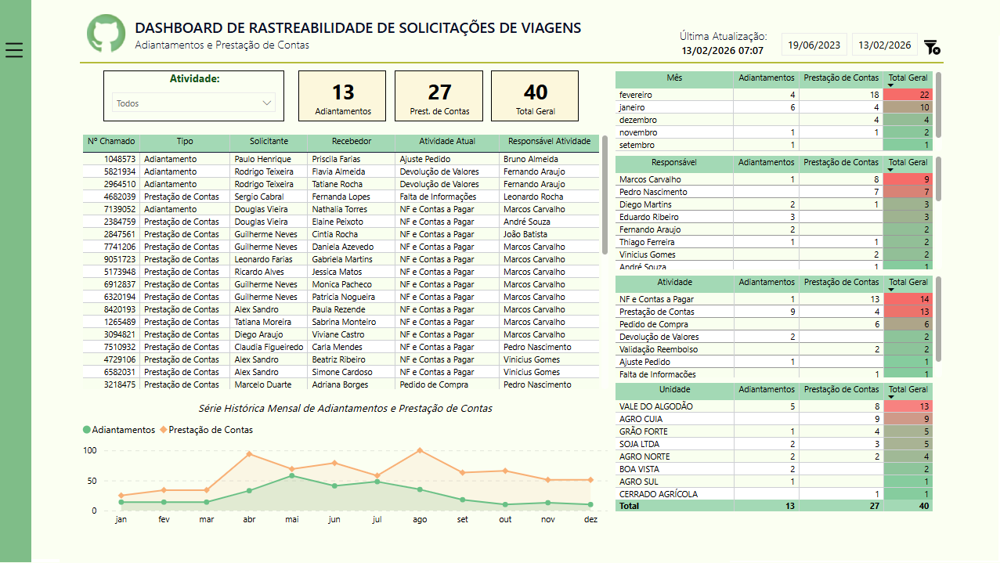
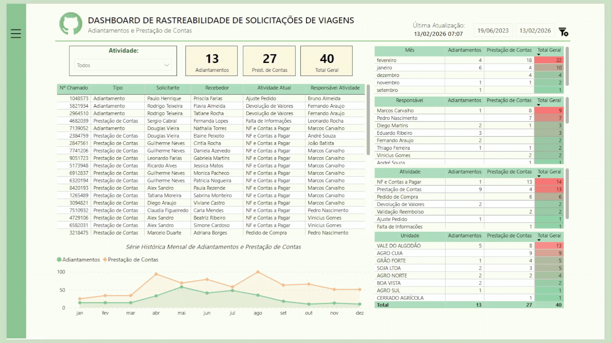

# 📊 Painel de Fluxo de Adiantamentos e Prestação de Contas de Viagens
🇺🇸 English version: [README.md](./README.md)

## 🎯 Objetivo

Apoiar a equipe administrativa fornecendo visibilidade clara sobre solicitações relacionadas a viagens, incluindo adiantamentos e prestações de contas, permitindo melhor acompanhamento das etapas do workflow, responsáveis atuais e atividades pendentes ao longo do processo.

---

## 🧰 Ferramentas & Tecnologias

* Power BI (Visualização de Dados & Construção de Dashboards)
* DAX (Medidas & KPIs)
* SQL (Extração de Dados & Consolidação de Workflow)
* Power Query (Limpeza e Modelagem de Dados)

---

## 📈 Principais Métricas

* Número total de solicitações
* Solicitações por tipo (Adiantamento vs Prestação de Contas)
* Solicitações por etapa atual do workflow
* Solicitações por responsável atual
* Solicitações por unidade de negócio
* Volume histórico mensal de adiantamentos e prestações de contas
* Acompanhamento de solicitações abertas vs concluídas

---

## 🖼️ Visualização do Dashboard

---

## 💡 Insights

* Fornece forte suporte para apresentações administrativas e gerenciais, oferecendo visibilidade clara sobre o status das solicitações relacionadas a viagens.
* Permite identificação rápida de em qual etapa do workflow cada solicitação se encontra e quem é o responsável pela atividade.
* Ajuda a monitorar gargalos no processo ao destacar solicitações concentradas em etapas específicas ou com usuários específicos.
* Apoia o acompanhamento do volume de solicitações por tipo, unidade de negócio e atividade, melhorando o controle operacional.
* Permite melhor acompanhamento de solicitações abertas e melhora a responsabilidade ao longo do workflow.

---

## 📂 Dados & Consultas

Este projeto inclui a consulta SQL em `queries.sql`, responsável por:

* Extrair a versão mais recente de cada solicitação de viagem
* Consolidar adiantamentos e prestações de contas em um dataset unificado
* Acompanhar o status do workflow (aberto e concluído)
* Mapear a etapa atual do workflow e o responsável
* Estruturar campos administrativos, financeiros e relacionados à viagem para análise

---

## 📊 Modelagem de Dados

Os dados foram estruturados e transformados no Power BI utilizando Power Query e DAX, permitindo análise do workflow por tipo de solicitação, atividade, responsável e unidade de negócio.

---

## ⚠️ Observações

* Todos os dados utilizados neste projeto foram **anonimizados e levemente ajustados** para preservar a confidencialidade.
* Rótulos e valores foram modificados mantendo a lógica analítica original e o contexto de negócio.

---

## 🚀 Impacto no Negócio

Este dashboard permite:

* Melhor controle administrativo sobre solicitações relacionadas a viagens
* Visibilidade clara sobre a etapa atual e o responsável de cada solicitação
* Identificação mais rápida de gargalos no processo e atividades pendentes
* Melhor acompanhamento de solicitações abertas e responsabilidade no workflow
* Tomada de decisão orientada por dados para melhorar a eficiência dos processos de despesas de viagem
